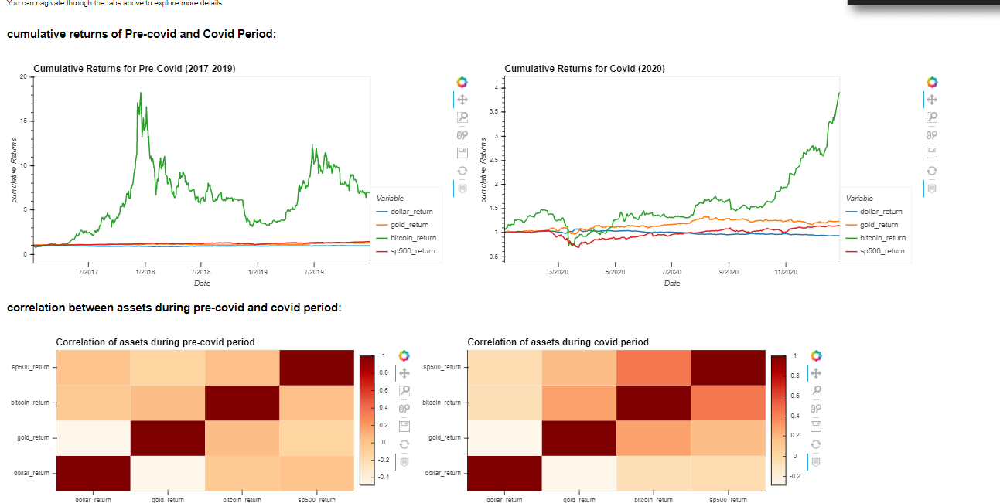
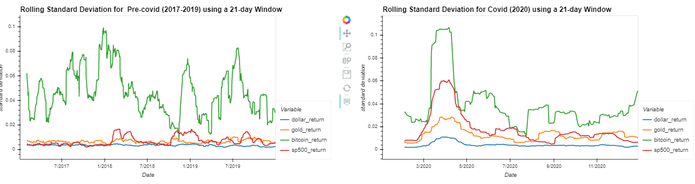
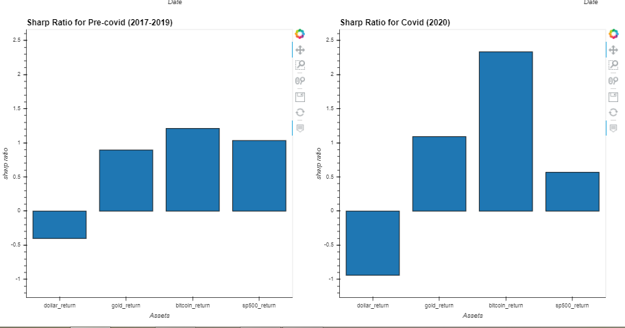
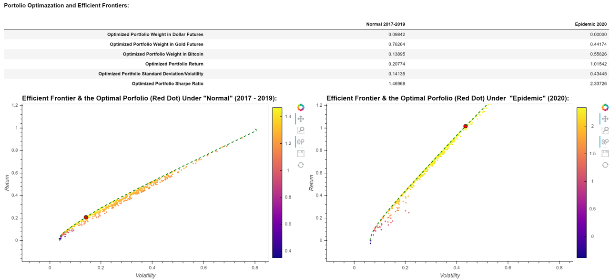
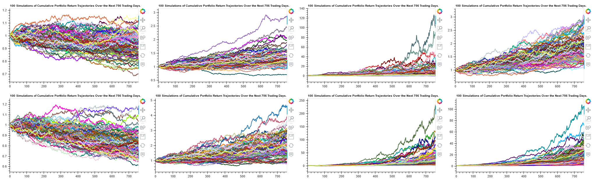
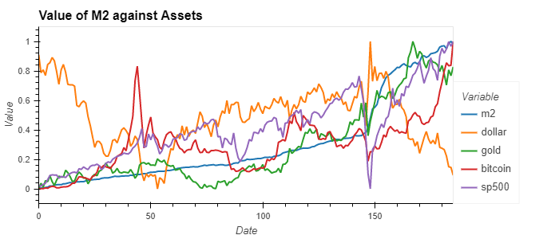
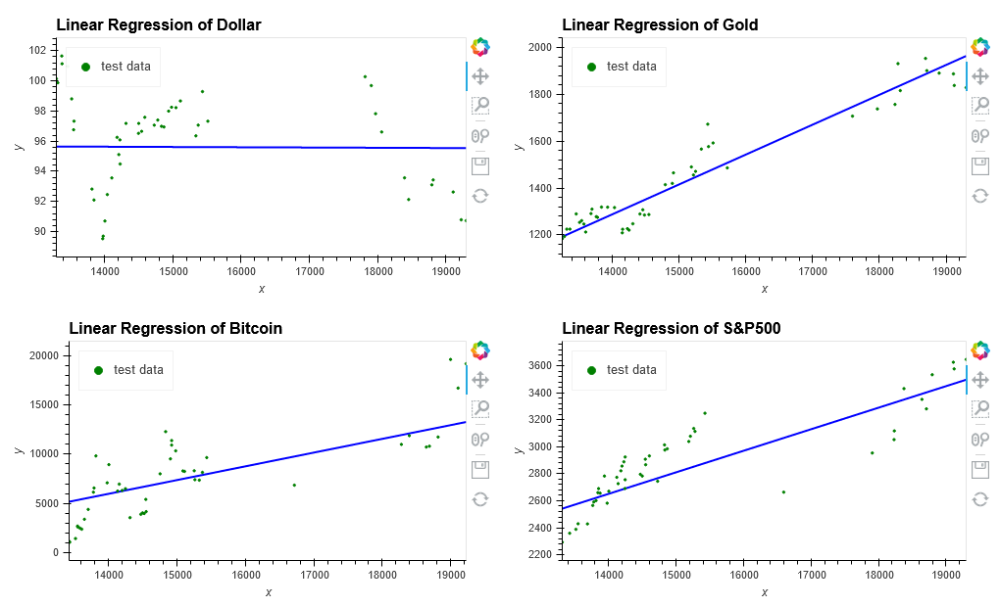

# Traditional Currency vs Paper Currency vs Cryptocurrency – which one should we invest in? 

## Table of Contents

    * Introduction
    * Purpose of the Project
    * Hypothesis
    * Technologies
    * Choice of Data Source and Cleaning
    * Calculations
    * Analysis
    * Recommendation

## Introduction:

It was only more than a decade ago when the world was brought to its knees by what is called the Global Financial Crisis (“GFC”) brought about by the housing bubble in the United States coupled with the excessive risk-taking behaviour by the banking sector. Now, the world is facing another global recession brought on by the Covid-19 pandemic. To say that the Covid-19 induced global recession could well be worse than the GFC may not be entirely false. The stock market crash in February of 2020 through end of March is seen as quick but the recession (and in some other countries, even a depression) was more lasting. There are predictions that some countries will only bounce back by year 2025. 

The measures taken by governments around the globe to have the pandemic under control included nationwide lockdowns and border closures which impacted trade and commerce both domestically and internationally. Tourism and hospitality are industries most negatively impacted resulting to significant rise in unemployment in these sectors. Consequently, unemployment caused food insecurity and rental and mortgage defaults. Governments around the globe had to step in to respond to the crisis by legislating stimulus packages which include monetary and/or fiscal stimulus to help businesses and individuals economically impacted by the pandemic. Stimulus packages calls for increased government spending and lowering of interest rates to fill in the output gaps in the economy. One effect of lowering interest rates is that the currency becomes less attractive to foreign investments thus weakening the exchange rate of the currency. This being said, how did the Covid-19 pandemic affect the US dollar as compared to gold and cryptocurrencies like the Bitcoin? Which of these currencies have responded negatively or positively to the pandemic and therefore which should one invest in considering that another black swan event like the Covid-19 pandemic may take place again?

## Purpose of the Project: 

    i) Identify the best performing type of currency during a “normal period” and during the “pandemic period”.  Currencies under consideration are the USD, Gold, and the     Bitcoin. 
    ii) Provide simulated performances for each type of currency for both a “normal period” and a “pandemic period” to yield a forecast that will help illustrate which type of currency to invest in during “normal period” and a “pandemic period”.  
    iii) Provide a visualisation of the findings based on the analysis conducted. 

## Hypothesis:

Factor: New Covid-19 outbreaks or mutation of Covid-19 against the vaccines

Independent Variable 1: If vaccine is effective and supply is efficient in 2021

      i)  Economic recovery will put pressure on Bitcoin and Gold prices
      ii) USD will be attractive again

Independent Variable 2: If there is a limited supply of vaccine or efficiency is lost due to virus mutation

      i)  More or prolonged quarantine time or lockdowns which will result to additional stimulus package boosting safe haven assets
      ii) Pressure on the value of the USD

## Technologies

   * Python language
   * NumPy
   * Matplotlib
   * Plotly
   * Seaborn
   * Bokeh

## Choice of Data Source and Cleaning

### Data

Other data provided for this project:

[M2.csv](Resources/M2.csv)

[m2-forecast-data.csv](Resources/m2-forecast-data.csv)

[n-transacations.csv](Resources/n-transactions.csv)

We have examined multiple data sources such as Alpaca, Quandl, FXCM, Alpha Vantage, Investing.com and Yahoo Finance.

### Alpaca 
Not Selected, as No Avaliable Data from Alpaca.

### Quandl 
Not Selected, as Missing Volume Data from Quandl.

### FXCM 
Not Selected, due to: 

         1) "tick quantity" is not volume but just an approximate for volume, and 
         2) need to convert the spread of bid/ask close to mid-close price.

### Alpha Vantage 
Not Selected, due to missing data for 2017.

### Investing.com 
Not Selected, due to: 

         1) No Volume Data from Investing.
         2) Extra cleaning need for Vol.
         
         However, Investing provides other useful data which might be used for the project, such as M2 money supply of USD. But, there is a large amount of missing daily data.
         
### Yahoo Finance
We have checked the data types, duplications, and missing data.  Yahoo Finance is Selected, as it provides highest data quality compared to other sources.

## Calculations

   * Historical daily returns
   * Cumulative returns of all portfolios
   * Averages for "normal period" and "pandemic period"
   * Daily standard deviation of all portfolios
   * Rolling moving averages for "normal period" and "pandemic period"
   * Rolling standard deviation using a 21-day window of each portfolio
   * Correlation during the "normal period" and "pandemic period"
   * Covariance, variance and rolling Beta during the "normal period" and "pandemic period"

## Analysis

   ### Asset Past Performance

Conducted a Return and Risk Analysis of Pre-covid and Covid period by initially extracting data from 2017-2019 data for pre-covid and 2020 data for covid period from the concatenated dataframe.

   * As seen on the graph, bitcoin is the most volatile among the other assets during pre-covid period whereas the other assets are pretty constant. However, during Covid Period, from March 2020 to September 2020 bitcoin has been relatively less volatile compared to pre-covid period. Conversely, gold return and SP500 have been relatively more volatile than in Pre-covid Period. 
   
   
   
   * While looking at the matrix that shows the correlation between the assets; during the pre-covid period, the correlation is near 0 which indicates that there is no linear relationship between the variables. During covid period, correlation between bitcoin and other assets increased, however, it's still close to 0. However, the correlation between the dollar return and the rest of the assets decreased.
   
   * As shown in the daily standard deviation dataframe; during covid, only standard deviation for bitcoin decreases whereas rest of the assets standard deviation increases. Even in the 21 window graph, it shows that volatility of SP500 has increased comparatively to the rest of the assets whereas the volatility of bitcoin has decreased.
   
   
   
   * After adjusting the risk, it is evident that bitcoin is the best performing asset during pre-covid and covid period. During pre-covid, bitcoin had a sharp ratio of 1.2 which is considered good for investors, whereas, during covid period bitcoin sharpe ratio was 2.3 which is considered very good by investors. The worst performing asset during both periods was the dollar. Hence, looking at the bar graph, investors would be more interested in bitcoin and gold as compared to the other two.
 
 

   ### Portfolio Optimization

Since these assets are not perfectly correlated. Forming a portfolio could reduce overall volatility for a defined expected return. The efficient frontier is the set of optimal portfolios that offers the highest expected return for a same level of risk, in the other words, the optimal portfolio gives the highest Sharpe ratio. Any portfolios below the efficient frontier are sub-optimal. Due to the curve shape of the efficient frontier, to find the true global minima, we applied the sequential least squares programming (SLSQP) optimizer from Scipy to calculate the optimal weighting with the objective of minimizing a negative Sharpe ratio which is equivalent to maximizing a positive Sharpe ratio of the portfolio.

   #### Finding
   
We have found the optimal portfolio weighting for the “Normal” 2017-2019, verse the “Epidemic” 2020, as displayed in the table.
   
Interestingly and firstly, under these scenarios, US Dollar futures is the least favorable asset to be included. Especially for the “Epidemic” scenario, the result suggests to avoid investing in US Dollar. Secondly, under the “Epidemic” scenario, although the assets are more volatile, Gold and Bitcoin performed much better and the portfolio could produce a much higher Sharpe ratio (2.37) comparing to under “Normal” scenario (1.47). The reason could be that investors were seeking a more defensive approach by investing more wealth into Gold and Bitcoin to against market uncertainty and inflation.

   ### Quantitative Forecast
    
   #### Monte Carlo Simulation
   
   Doing 100 times of simulation of four different assets and optimized portfolio’s performance in  next three years based on Monte Carlo Simulation for the stated hypothesis. 
 
 
 
   #### Results - If everything back to Normal Condition, simulate based on data from 2017 to 2019
   
   * There is a 95% chance that an initial investment of $10000 in gold over the next 3 years will end within in the range of $8765.71 and $17949.12
   * There is a 95% chance that an initial investment of $10000 in dollar over the next 3 years will end within in the range of $7444.8 and $11020.65
   * There is a 95% chance that an initial investment of $10000 in bitcoin over the next 3 years will end within in the range of $3492.1 and $421000.78
   * There is a 95% chance that an initial investment of $10000 in sp500 over the next 3 years will end within in the range of $9451.43 and $21452.26
   * There is a 95% chance that an initial investment of $10000 in the portfolio over the next 3 years will end within in the range of $10230.4 and $31092.97
   
   #### Results - If pandemic Condition does not improve, simulate based on data in 2020
   
   * There is a 95% chance that an initial investment of $10000 in gold over the next 30 years will end within in the range of $8814.53 and $39061.98
   * There is a 95% chance that an initial investment of $10000 in dollar over the next 30 years will end within in the range of $6360.55 and $10541.42
   * There is a 95% chance that an initial investment of $10000 in bitcoin over the next 30 years will end within in the range of $21746.03 and $1429953.07
   * There is a 95% chance that an initial investment of $10000 in sp500 over the next 30 years will end within in the range of $3978.24 and $63534.6
   * There is a 95% chance that an initial investment of $10000 in the portfolio over the next 30 years will end within in the range of $48920.13 and $542433.28
   
   #### Forecast: US M2 Money Supply
   
Gold and M2 are highly positively correlated(0.953), next is sp500 followed by bitcoin. Dollar index on the other hand does not have much correlation with M2(only -0.09).

   
   
   #### Linear Regression
   
By using linear_model among sklearn library, we can construct linear regression to model the relationship betweenM2 and four assets so as to predict their value in the first half of 2012. 

    

   #### Results
* In Jan 2021 , m2 money supply will be 19250.0, it is predicted that gold will be $1957.5, dollar index will be $95.54,bitcoin will be $13299.4, S&P 500 will be 3489.4
* In Feb 2021 , m2 money supply will be 19350.0, it is predicted that gold will be $1970.27, dollar index will be $95.54, bitcoin will be $13439.0, S&P 500 will be 3505.37
* In Mar 2021 , m2 money supply will be 19444.0, it is predicted that gold will be $1982.28, dollar index will be $95.54, bitcoin will be $13570.3, S&P 500 will be 3520.38
* In Apr 2021 , m2 money supply will be 19501.0, it is predicted that gold will be $1989.56, dollar index will be $95.54, bitcoin will be $13649.9, S&P 500 will be 3529.48
* In May 2021 , m2 money supply will be 19666.0, it is predicted that gold will be $2010.64, dollar index will be $95.53, bitcoin will be $13880.4, S&P 500 will be 3555.83
* In Jun 2021 , m2 money supply will be 19830.0, it is predicted that gold will be $2031.59, dollar index will be $95.53, bitcoin will be $14109.4, S&P 500 will be 3582.01
* In Jul 2021 , m2 money supply will be 20023.0, it is predicted that gold will be $2056.25, dollar index will be $95.53, bitcoin will be $14378.9, S&P 500 will be 3612.83

   ### Possible rationale behind these price movements and relationships 

   #### Scarcity

The supply of bitcoin is constant and once the maximum number of bitcoins is mined there cannot be anymore created. This works much like gold, where there is a finite quantity of gold in the world, the asset has natural scarcity. 

This juxtaposes fiat currency such as the USD, where monetary policy decisions made by regulators such as the federal reserve can manipulate the supply of the currency. In this way, both bitcoin and gold can be seen as hedges against USD monetary inflation. When the US, for instance, decides to give everyone $600 in the stimulus or increase the M2 money supply in the overnight money market, this injects money into the economy, the supply of USD increases and inflation is more likely. All whilst, the supply of bitcoin and gold supplies remains a constant and can therefore offer protection against this inflation.

   #### Adoption / Use

In terms of aggregate value, adoption perhaps plays the largest role in maintaining the value of currency long term. Because fiat currency such as the USD is backed by the government, it has a degree of stability in terms of legitimacy, promoting its use and in turn driving its demand and value. 

This is where bitcoin is a tad risky, at this current point in time bitcoin’s value is driven more by speculation than through it’s adoption or use, although there is a moderate correlation between the two of ~0.3 [graph]. That being said we’ve seen square and PayPal partner with Bitcoin and support its use by 2021 and we may continue to see adoption-based value improve. 

Gold on the other hand has more questionable adoption value, mankind's attitude to gold is truly bizarre! The adoption of gold giving it intrinsic value can be explained using countless theories, but the most prevailing is its traditional value. The value of gold has survived the test of time, societies and economies have long placed value in it, thus perpetuating it’s worth.

   #### Speculation

Perhaps the most interesting price dynamic, however, is through speculation, where investors way up political, social and economic variables to value an asset and these they might influence scarcity and adoption of an asset. 

With 2020 we’ve seen many complications worldwide, but particularly in the US. There has been civil unrest, a pandemic sweeping over the nation, election delays and instability, rising government debt and with these complications, waves of uncertainty. With this uncertainty scepticism of governments and the government policies themselves have only grown. Moreover, it’s been seen the more worldly conflict or uncertainty there is in the world, the fewer confidence people place in governments and with extension, their fiat currency and the more speculators resort to bitcoin, gold and other alternate assets to hedge. It’s this fear and lack of confidence in centralized asset classes that drives demand for the decentralized alternatives. A genuine risk into 2021 that might explain the fall in USD value and a huge rise in Bitcoin and Gold could be the risk of stagflation and hyperinflation. The fed and other world banks have continued to drop interest rates to stimulate the economy during the pandemic. However, there is evidence in the USA that suggests inflation expectations are rising and the employment situation is weakening in tandem, leaving the fed in a tough spot in terms of leverage to inject money into the economy, whilst maintaining low inflation. If the economy doesn’t start to pick up stagflation and even possibly hyperinflation could become legitimate fears bringing into question the legitimately of the USD and potentially propel other asset classes such as bitcoin and gold.

## Recommendation

In view of the calculations and made and the analysis above, the results suggest to invest more in Bitcoin and Gold, and to avoid US dollar whether conditions go back to normal or the epidemic will continue to persist in spreading.
   

